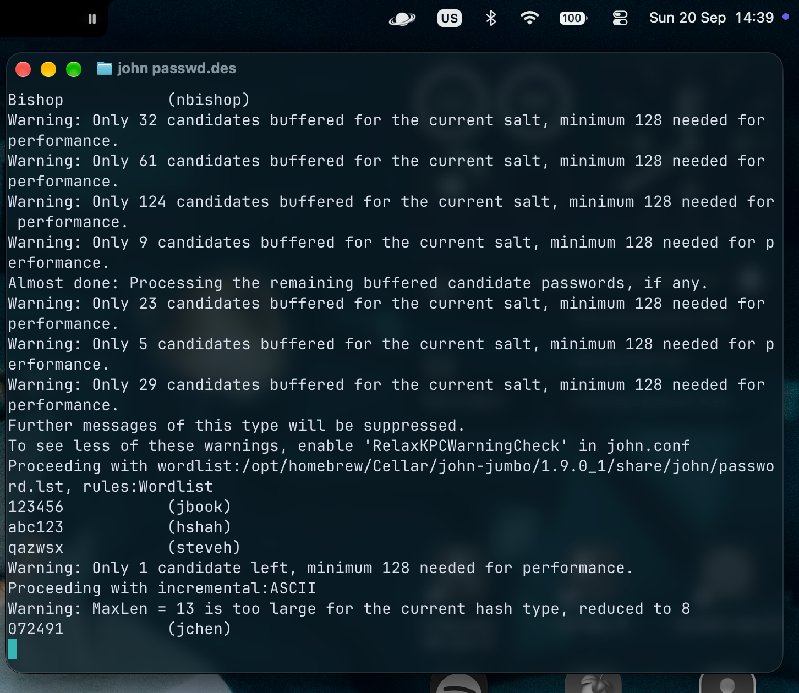
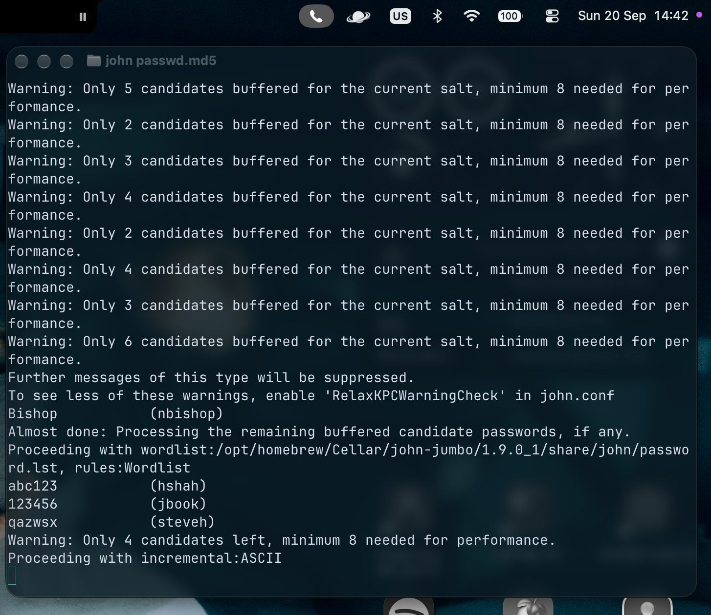

# Password Cracking with John the Ripper

## Overview
This project documents an authorized academic cybersecurity lab focused on password security and password cracking using John the Ripper.

The lab used instructor-provided DES and MD5 password files to demonstrate how password hashes can be attacked using wordlists, rules, and incremental cracking techniques.

## Environment
- macOS
- Terminal
- John the Ripper
- Instructor-provided `passwd.des` and `passwd.md5` files

## Techniques Practiced
- Password hash cracking
- Dictionary attacks
- Rule-based wordlist attacks
- Incremental password cracking

## Procedure
1. Installed and configured John the Ripper on macOS.
2. Loaded the provided DES password file into John the Ripper.
3. Ran John the Ripper against the DES hashes and reviewed recovered credentials.
4. Repeated the process using the provided MD5 password file.
5. Used John the Ripper's included password wordlist and rules to perform a dictionary-based attack against the MD5 hashes.
6. Observed the transition from wordlist-based cracking to incremental cracking when additional candidates were needed.

## Results
John the Ripper successfully recovered multiple passwords from the provided password files.

The exercise demonstrated how weak and predictable passwords can be recovered using automated password cracking techniques, even when only password hashes are available.

## What I Learned
- How password hashes are used as part of authentication systems.
- How password cracking tools compare candidate password hashes against stored hashes.
- The difference between dictionary-based and incremental cracking approaches.
- How weak or commonly used passwords are vulnerable to automated attacks.
- Why strong password policies and secure password storage practices are important.

## Screenshots

### DES Password Cracking

### MD5 Password Cracking

## Ethical Context
This activity was completed as part of an authorized academic cybersecurity lab using instructor-provided password files in a controlled environment.
