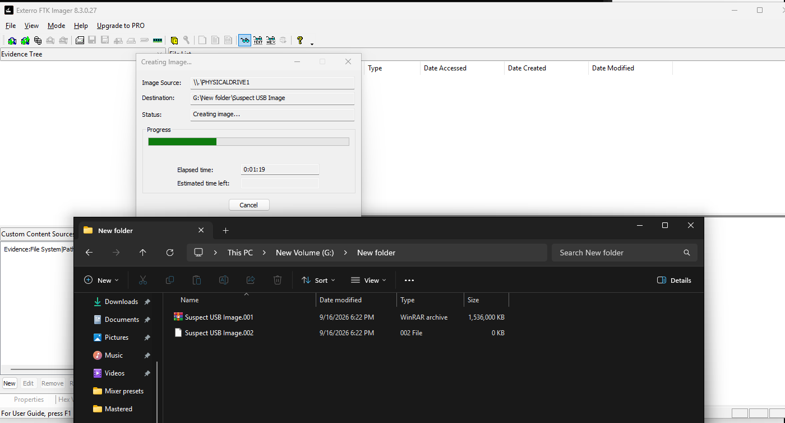
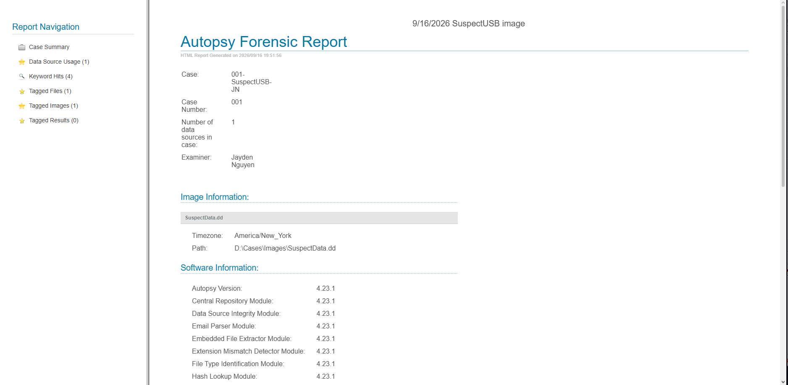

# Digital Forensics Investigation

## Overview
Completed in a Forensic Computing class, this project involved digital forensic data acquisition, extraction, and analysis on Windows using FTK Imager and Autopsy. The class provided a `SuspectData.dd` image for investigation.

## Environment and Tools
- Windows
- FTK Imager
- Autopsy
- Provided `SuspectData.dd` image

## Investigation Workflow
1. Performed data acquisition using FTK Imager on Windows.
2. Created an Autopsy case and added the provided `SuspectData.dd` image for analysis.
3. Extracted and analyzed data from the image.
4. Created search words and performed keyword searches in Autopsy.
5. Tagged images and files in Autopsy.
6. Generated an Autopsy report.

## Screenshots

### FTK Imager — Data Acquisition

### Autopsy — Forensic Report

## Skills Practiced
- Forensic data acquisition
- Data extraction and disk image analysis
- Autopsy case creation
- Keyword searching
- Image and file tagging
- Forensic report generation

## Project Scope
This README summarizes the class workflow. It does not present specific investigative findings. The repository includes the two screenshots; the source disk image and full Autopsy report are not included.
